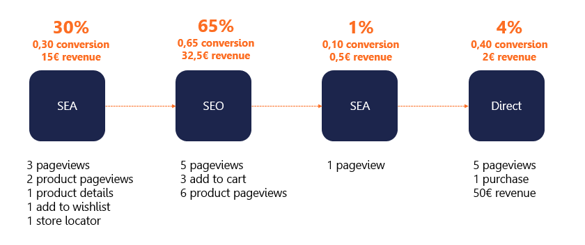

# C. Data-driven attribution model

> In addition to our data-driven attribution models, we also offer **classical ones**: first click, last click, linear etc.

Adloop data-driven attribution model is based on users' behaviour. We use all the micro-conversions available in your Analytics source, like key pageviews (product or category), click on a CTA, add to basket and so on.

The **more micro-conversions** you are tracking, the **more detailled our data-driven model** will be! So don't hesitate to track new actions on your website.

Then, for each micro-conversion, you have to indicate to Adloop **how engaging this action** is on the path to conversion. For that, we use commitment levels, from very low to very high.

By default we scale:

* the _pageview_ as very low commitment, as viewing a page is the most basic action you can do on a website
* the _new users_ as very high commitment, as it gives value to the upper-funnel channels bringing in new users

Some examples of scaling that could help you when setting up the data-driven attribution model:

* _view of a product page_: low commitment
* _view of a category page_: low commitment
* _displaying the details of a product_: medium commitment
* _add to wishlist_: high commitment
* _add to basket_: very high commitment
* _subscribe to newsletter_: very high commitment
* _store locator_: medium commitment
* _demo booking_: very high commitment

Those are just few examples, as every website is different, you are the best to judge how engaging the actions on your website are.

> If you don't know which micro-conversions to use, just navigate on your website and put yourself in the shoes of a potential customer discovering your website for the first time and then purchasing!

We scale differently the different steps of the conversion funnel: delivery choice, delivery address, contact information, payment choice. Those are not to be included in the commitment scaling step.

Our algorithm will take into account the scaling of the micro-conversions when calculating attribution.

**The more a user interacts with the website on a touchpoint, the more credit this touchpoint will get when calculating the attribution and contribution.** This touchpoint will get a bigger fraction of the conversion and of the revenue.

## Attribution set up

