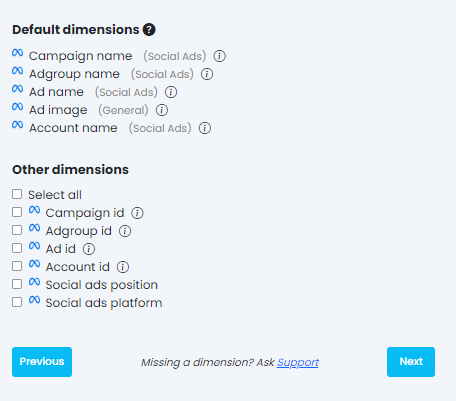
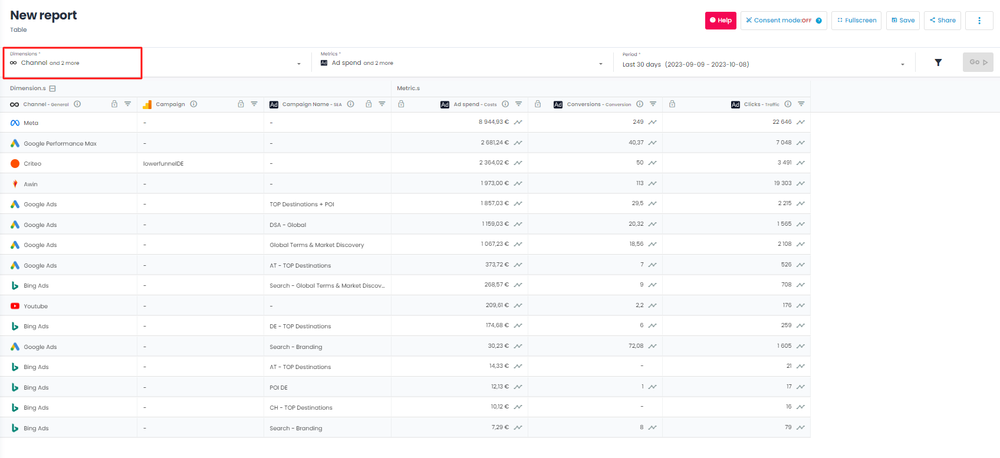
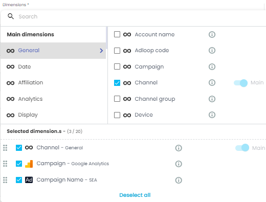
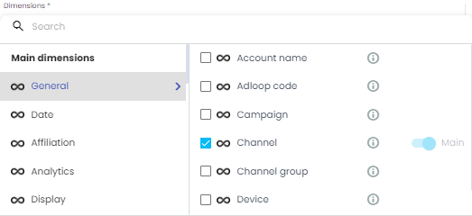
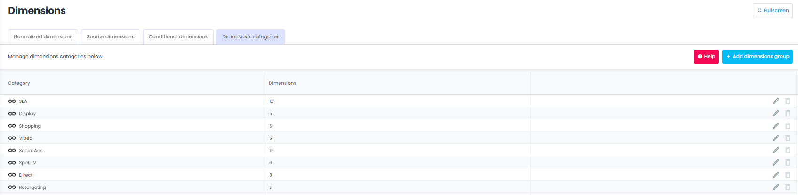

# Dimensions in Adloop

> On the same topic, see [Reports > Dimensions menu](III---Adloop-reports-system-📈.md)

Dimensions are the names, categories or characteristics of digital marketing campaigns. 

Each Platform has its own dimensions, but some are common to most of them, like  **campaigns name** ,  **ads name** ,  **objectives**  etc.

## 1 - Imported dimensions from Data Sources 
For each source in the data Sources list, Adloop team has selected the most relevant dimensions:  

* Some are imported by default ( **default Dimensions** ) - you can’t remove them

* Some are optional and you can select the ones you want to have in Adloop and ignore the others ( **other Dimensions** ).

Facebook Ads example:  

> Dimensions always have a logo in front of their name, so you can identify the data source they are coming from. 
\
Google Ads dimensions will have a  logo in front of them, those from Facebook Ads a  and so on. 

## 2 - Normalised dimensions ( logo)
> Some dimensions are common to all sources: the normalized dimensions in Adloop. They have a :Ad_centric: logo in front of them. 

### a - Why those normalized dimensions? 
Some dimensions are common to most of the  **Ad platforms** . So instead of having to choose several times the same dimension, we grouped them within the normalized dimensions. 

Example: 

* Google Ads campaigns names exist in Adloop under the dimension :Google_Ads: **Campaign name** 

* Bing Ads campaigns names exist in Adloop under the dimension :Bing_ads: **Campaign name** 

* Both are grouped under the normalized dimension :Ad_centric: **Campaign name (SEA)** 

> In a  **Report** , you have  **Dimensions**  from Google Ads and Bing Ads and you want to see the performances of both those channels. Instead of having two columns :Google_Ads: **Campaign name** and :Bing_ads: **Campaign name** , just use the normalized dimension :Ad_centric: **Campaign name (SEA)** , you will only have one column. 

### b - Which are the normalized dimensions? 
Our normalized dimensions in Adloop are:  

|  **Channel type**  |  **Normalized dimension**  | 
|  --- |  --- | 
| SEA | :Ad_centric: **Campaign name**  | 
| SEA | :Ad_centric: **Adgroup name**  | 
| SEA | :Ad_centric: **Keyword**  | 
| SEA | :Ad_centric: **Network**  | 
| SEA | :Ad_centric: **Matchtype**  | 
| Social Ads | :Ad_centric: **Campaign name**  | 
| Social Ads | :Ad_centric: **Adgroup name**  | 
| Social Ads | :Ad_centric: **Ad name**  | 
| Affiliates | :Ad_centric: **Affiliate**  | 
| Affiliates | :Ad_centric: **Affiliate type**  | 
| Video | :Ad_centric: **Campaign name**  | 
| Video | :Ad_centric: **Adgroup name**  | 
| Video | :Ad_centric: **Network**  | 
| Video | :Ad_centric: **Site**  | 
| Video | :Ad_centric: **Title**  | 
| Shopping | :Ad_centric: **Campaign name**  | 
| Shopping | :Ad_centric: **Adgroup name**  | 
| Shopping | :Ad_centric: **Product name**  | 
| Retargeting | :Ad_centric: **Campaign name**  | 
| Display | :Ad_centric: **Campaign**  | 
| Display | :Ad_centric: **Placement**  | 
| Display | :Ad_centric: **Ad**  | 
| Display | :Ad_centric: **Site**  | 
| Display | :Ad_centric: **Creative**  | 

### c - Where to find the normalized dimensions? 
You can find them under the  **Dimensions menu**  in the  **Reports** . 

Dimensions menu: 

Dimensions menu when opened: 

## 3 - Adloop dimensions ( :adloop: icon)
Some dimensions were created by Adloop to help marketing professionals to make a better use of data. The icon :adloop: is in front of them.

The Adloop dimensions are:

|  **Adloop dimensions**  |  **Details**  | 
|  --- |  --- | 
| :adloop: **Channel**  | Marketing channel, most of the time it is the Data Source.  | 
| :adloop: **Channel type**  | The parent category of the channel: SEA, Affiliate, Social etc.  | 
| :adloop: **Device**  | Device used | 
| :adloop: **Adloop Code**  |  | 
| :adloop: **Day**  | Adds a day (date) segmentation column to the data | 
| :adloop: **Week**  | Adds a week (week number) segmentation column to the data  | 
| :adloop: **Month**  | Adds a month (month name) segmentation column to the data  | 
| :adloop: **Year**  | Adds a year segmentation column to the data  | 

Adloop dimensions can mostly be found in the “General” category of the Dimensions menu:  

## 4 - Dimensions categories
 **Dimensions**  are organized into categories defined by the Adloop teams.

The default categories cannot be deleted but their names can still be edited in the  **Dimensions**  management page. You can add as many  **dimensions**  as you want to organize the menus the way you want.

## Managing dimensions

<iframe frameborder="0" width="640" height="480" src="https://www.youtube.com/embed/gscBg3xYd54?rel=0" data-iframe-loaded="true" allowfullscreen="" scrolling="yes" allow="autoplay; encrypted-media; clipboard-write"></iframe>
