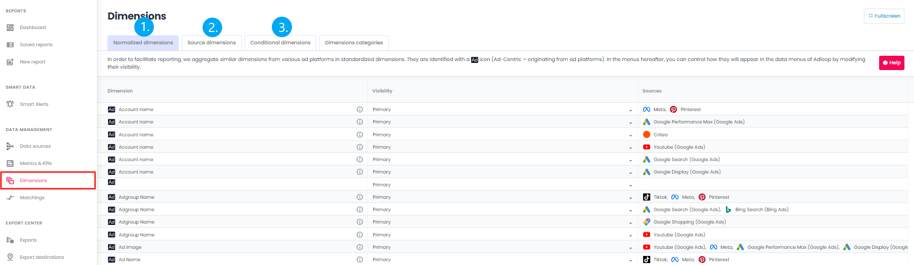

# Dimensions management page

The Dimensions management page is available from the menu.

This page allows you to view and manage :

1. Standard dimensions
2. Source dimensions
3. The categories of the Dimensions

## Visibility management options

## Managing dimensions

<iframe frameborder="0" width="640" height="480" src="https://www.youtube.com/embed/gscBg3xYd54?rel=0" data-iframe-loaded="true" allowfullscreen="" scrolling="yes" allow="autoplay; encrypted-media; clipboard-write"></iframe>
