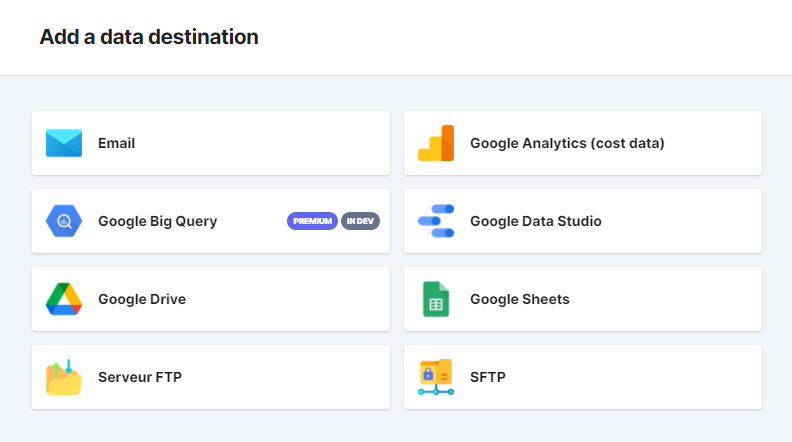
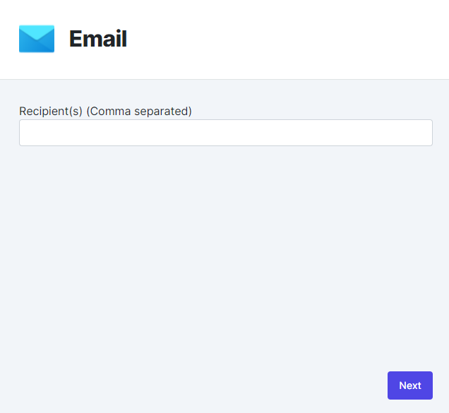

# Export Destinations

> Exports enables you to export sets of data (built in  **Reports** ) in standart formats to applications outside Adloop. Those sets of data are automatically updated according to the chosen frequency #timesaver :smiley:

## 1 - What is an Export Destination?
Very simple! Before being able to export data, you have to define a Destination. It is the location the Export will arrive to. 

We are regularly adding new Destinations, email is the default destination. But sending data goes through Analytics apps, Data Visualisation or Datamarts. 

To add Destinations other than email, you must have the corresponding access rights. If you don’t have access to it, contact your administrator within your organization. 

> To add a destination, simply click on  **+Add**  in  **Export Destinations**  and choose the desired Destination in the list.

## 2 - Available Export Destination
> During the process of creating a destination, you will have to fill in a destination name. We advise you to give a precise name to each Destination you create, it will be easier later on.

To this day, the available Destinations are:

|  **Export Destinations**  |  **Details**  | 
|  --- |  --- | 
|  | Email adresses that the export file must be sent to (a single email adress is also possible)No authentification needed but be careful about the spaming | 
|  | Sends the file into a file of your Google DriveAuthentification with Google  _credentials_ (see below) | 
|  | Sends the file into a file of your FTP server (port 21)Authentification with login / password (see below)  | 
|  | Sends the file into a file of your SFTP server (port 22)Authentification with login / password (see below)  | 

### a - Email Destination
Nothing particularly difficult. Just type in the email adresses, separated by a comma in case of multiples email adresses.

### b - Google Drive Destination 

See our [dedicated Google Drive page](Google-Drive-Destination-🚶‍♂️🚶‍♀️.md).

### c - Server FTP ou SFTP Destination 
See [our dedicated FTP/SFTP page](FTP-or-sFTP-Destination🚶‍♂️🚶‍♀️.md).

### d - Google Chat Destination 
Adloop sends the export files into a Google Chat room. See our step by step explanation in [our dedicated Google Chat page](Google-Chat-Destination-🚶‍♂️🚶‍♀️.md). 

### e- Slack Destination
Adloop sends the export files into a Slack channel. See our step by step explanation in [our dedicated Slack page](Slack-Destination🚶‍♂️🚶‍♀️.md). 

## Export destinations

<iframe frameborder="0" width="640" height="480" src="https://www.youtube.com/embed/t9VKwNOoEp0?rel=0" data-iframe-loaded="true" allowfullscreen="" scrolling="yes" allow="autoplay; encrypted-media; clipboard-write"></iframe>
