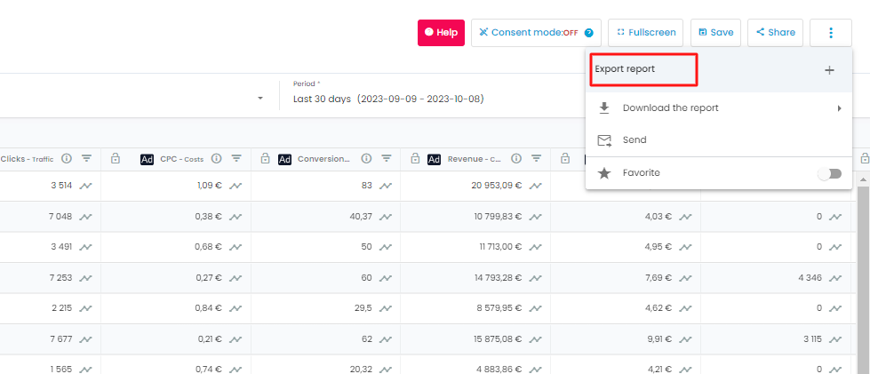

# Exports
> Exports allow you to export datasets (built with  **Reports)**  into standard formats to applications outside of Adloop. Those datasets will update automatically according to the chosen frequency #timesaver 

## 1 - Our objective: send fresh data without effort to your data ecosystem
Adloop says  to copying - pasting! Updating your Dashboards, Excels, Datamarts with marketing data must take 5 minutes per day, tops. Set up your exports and Adloop will send the data in time.  

 **_What will I be able to export?_** 

You can export everything that is in your Dataset. All the normalized dimensions or the ones that are source-specific, all the standards or calculated metrics, EVERYTHING! We can’t do more than that . 

 **_What triggers the Exports?_** 

They will be sent automatically depending on the frequency set-up once the data sources are updated. 

> Adloop is first getting fresh data from the Data Sources we are connected too, and then we send the exports.
\
If some data couldn’t be updated, because the Data Source was unavailable, Adloop will nonetheless send the export. Then, we will do it again once the data have been updated. 

@Timothée Leicht peux tu vérifier l’assertion ci-dessus ? **_How frequently?_** 

You can choose how frequentLY the exports need to be sent: several times per day, daily, weekly etc. 

 **_Where do the Exports go?_** 

Several Destinations are available, Exports can come under the form of CSV or Excel files, as well as data feeds to databases. Most of the time, our Exports are used to feed  **Dashboards**  built under Excel, Google Data Studio, Tableau… or Datamarts in AWS, Azure, Snowflake…

 **_How do I select the data to put in my Export?_** 

First, you have to build a  **Report**  containing all the data you want to send in your Export. A  **Date**  type column (day, week, month, year) will probably necessary in order for the external application to deal with the data.

## 2 - Components of an Adloop Export 
 > **Prerequisites**  - In order for the Exports to function, you need first to set-up:
* One or several  **Data Sources** 
\
* A  **Report**  with the data to export
\
* One or several [[ **Export Destinations** |Export-Destinations]]

An Export needs several elements to function: 

|  **Element**  |  **Details**  | 
|-|-|
|  **Destination**  | The Destination is the application the Export will be send to. You must have created an `[[ **Export Destination** \|Export-Destinations]]`  first.  | 
|  **Report**  | The  **Report**  with the data you want to export. > You have to create your  **Report**  and save it to find it the list of the Reports you can export. To find it easily, give it a distinct name. | 
|  **Segmentation**  | By default, the data in the report are agregated on the selected timeframe. If you want to have a breakdown per day or per week, you have to segment your data. > Often, external applications will ask for segmented data (per day or per month).  |
|  **Format**  | Adloop exporte les données dans des formats standards (Excel, CSV). Certaines destinations demandent des formats spécifiques qui sont gérés nativement par Adloop. |
|  **Frequency**  | How often you want Adloop to export your data |
|  **Name**  | The Export name is completely free, but we advise you to be precise. Indeed, if one day you have 15 active Exports, you will be happy you named them right in the beginning!   |

## 3 - Create an Export

### From the Exports page in the Export Center
Go to the Exports page using the sidebar, you can create an Export by clicking on :Add:

### From the Report to Export
You can create an Export directly from the Report you are creating or editing by clicking on the button :more: ( _More_  button) and by selecting the corresponding menu item.

## Exports

<iframe frameborder="0" width="640" height="480" src="https://www.youtube.com/embed/nG_GQBbaad0?rel=0" data-iframe-loaded="true" allowfullscreen="" scrolling="yes" allow="autoplay; encrypted-media; clipboard-write"></iframe>
