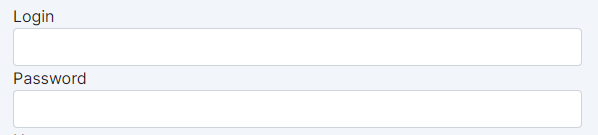
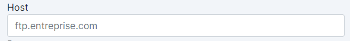
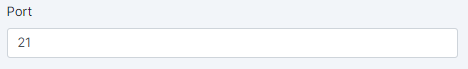
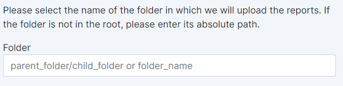

# FTP or sFTP Destination🚶‍♂️🚶‍♀️

Adloop sends and updates the exports in a folder available on a FTP server (port 21) or sFTP (port 22). 

> The process and the fields to fill in are the same for FTP and sFTP. The only difference is that sFTP uses an encryption key to secure the data.  

To allow Adloop to write in your FTP, you must connect it to Adloop with:  

<ol>
  <li>The server FTP address</li>
  <li>Login and password</li>
  <li>A folder name, if needed</li>
</ol>

## 1 - Allow Adloop to access your FTP
The connection process is just filling in the form boxes. 

 **Login and password** (sent by a system admin)

 **Host** : address of your FTP server

noteIt must look like this: [ftp.company.com](http://ftp.company.com)

> It must look like this: [ftp.company.com](http://ftp.company.com)

 **Port** : fill in the desired FTP port

> 21 is the FTP default port / 22 is the sFTP default port
You can use another port, sent by your system admin

**Destination Folder** : indicate the folder in which the files will be dropped.

## 2 - Submitting and checking the connection
By clicking on Submit, your connection will be checked according to your parameters. 

In case the connection fails, you will have an alert: 

If the connection is OK, you just need to name this Destination and you are done! 

Your FTP or sFTP destination will now appear in your destinations list. 
