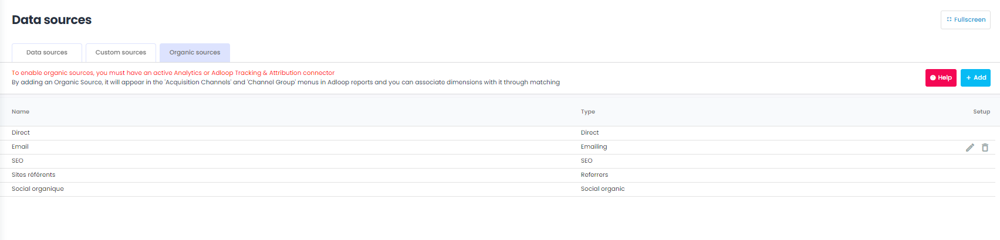
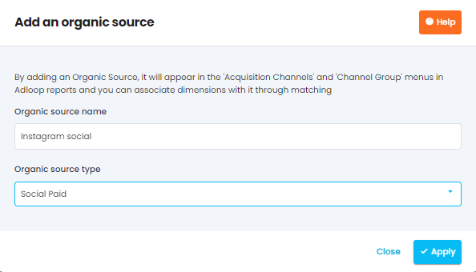

# Organic sources

In Adloop you can have a 360 view of your digital channels, so this includes natural channels like Direct, SEO or referrers.

As there is no import of data related to these sources (no external data), only data from Analytics, there is no need to create custom data sources.

In the  **Matching**  >  **Organic Sources**  tab, you can manage your different organic sources.

By default, 4 are already created:

* SEO

* Direct

* Social organic

* Referral sites

To create a new organic source, click on the "Add" button. You must then fill in the name of your source and its type.

Example: Instagram organic / Social 

You must then match this organic data source with the Analytics data (in other words, you must now declare the channel).

To do this, go back to the "Data Source" tab and click on "Add". You arrive in the interface for creating a match.

In the drop-down list, choose the organic source you just created. You can then follow the [[usual matching procedure.|Matching]]

## Organic sources

<iframe frameborder="0" width="640" height="480" src="https://www.youtube.com/embed/xp4bO9pkWB0?rel=0" data-iframe-loaded="true" allowfullscreen="" scrolling="yes" allow="autoplay; encrypted-media; clipboard-write"></iframe>
