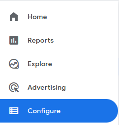
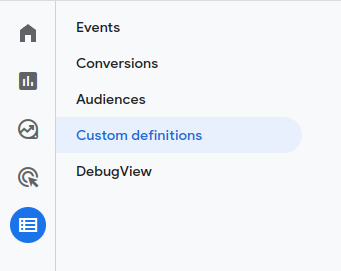
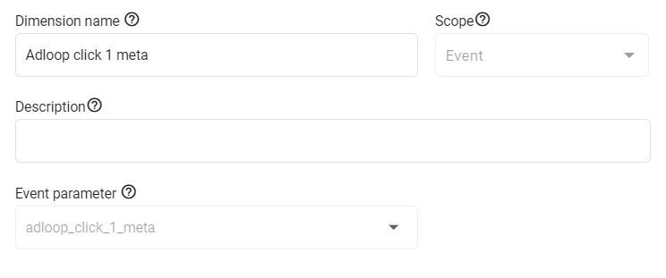

# Pre-requisite for the Adloop script

With Google Analytics UAWe need you to create a custom dimension in Google Analytics, in which we will put the information gathered by our script.

Specifications of the custom dimension: 

* scope: session

* name: Adloop Click

* number of custom dimensions: if you have GA360, a custom dimension for every 75 000 daily sessions is needed ; if you don’t have GA360, a custom dimension for every 50 000 sessions is needed.

Also, you’ll need the list of excluded referrers (especially payment platforms) when doing the set-up in Adloop. 

You’ll find this list in GA > Admin > Property > Tracking Info > Referral Exclusion List.

With Google Analytics 4
* Go to "Configure"

* Go to "Custom Definitions"

* Create 2 custom dimensions dedicated to Adloop:

    * The first one: 

    * Click on "Create custom dimensions"

    * Name it Adloop Click 1

    * Select "Event" as scope

    * Event parameter: adloop_click_1

    
    * The second one:

    * Click on "Create custom dimensions"

    * Name it Adloop Click 1 Meta

    * Select "Event" as scope

    * Event parameter: adloop_click_1_meta

    

    

Also, you’ll need the list of excluded referrers that you will find in GA4 under Data Streams > Configure Tag settings > All settings > List unwanted referrals 

With PianoCreate two custom dimensions adl1 and adl1_meta

Type: String

The dimension does not contain personal data 

*****

[[category.storage-team]] 
[[category.confluence]] 
