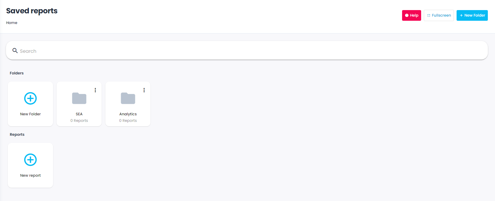

The saved reports page show the reports you saved as well as the ones shared by your teammates. 

Reports are identified by their name, hence paying attention to their naming! 

## 1 - Create a new Report 
To create a new Report, simply click on  **+Add**  and the Templates screen will appear 

## 2 - Reports Templates
You can start an  **Empty Report**  but also use the  **Reports Templates**  offered by Adloop, in order to open an already constructed report with  **Dimensions**  and  **Metrics**  that you can use for your specific needs. 

note **Reports Templates**  were created for specific objectives on marketing channels (SEA, Social etc.) but also to make  **Google Data Studio**  exports. 

 **Reports Templates**  were created for specific objectives on marketing channels (SEA, Social etc.) but also to make  **Google Data Studio**  exports. 

## 3 - Screen items

|  **Item**  |  **Meaning**  | 
|  --- |  --- | 
|  | Personal report (not share, can only be seen by you)  | 
|  | Report you created and shared to others  | 
|  | Report shared by another user | 
|  | Favorite report, will appear at the top of the saved reports list | 
|  | Open the report in a new tab | 
|  | Delete the report | 

