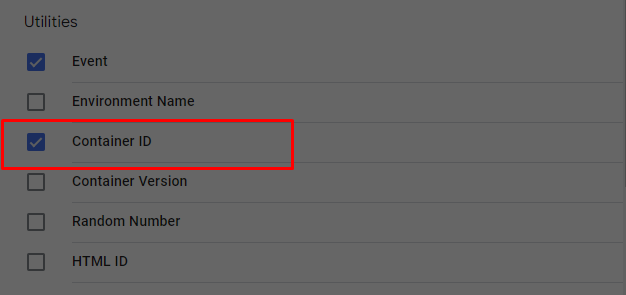
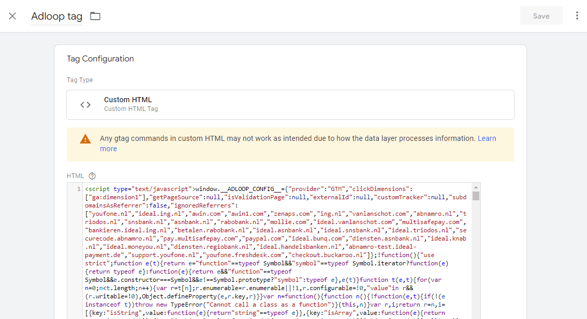

# Script installation on GTM

With Google Analytics UA

* Go to the "Variables" section
* Make sure the Container ID is listed under the Build-In Variables
  * If not, click “Configure”, search for Container ID under “Utilities” and enable it

* Create "User defined variables" following this scheme:
  * Type of variable: Data layer variable
  * Name of the data layer variable: indicate the value you set up in your custom dimension on GA4 in the event parameter field (ex: adloop\_click\_1).
  * And give it an adloop related name
  * Repeat these operations for all custom dimensions created in GA

* Open the configuration of the "Google Analytics settings" variable,&#x20;
* In "More Settings -> Custom Dimensions, click on "Add Custom Dimension"
* Fill in the following information:
  * Index: XX (where "XX" is the index of the dimension created on GA)
  * Dimension value: \{{adloop\_click\_XX\}} (Use the brick to choose the previously created variable)
  * Repeat these operations for all variables created in GTM

* Go to the "Tags" section and add a new tag of type "Custom HTML", with the name "Adloop tag".
* Copy and paste the content provided on the Adloop interface into the "HTML" field of the tag
* Save the tag without trigger

* Open the configuration of the Google Analytics tag with the largest trigger ("All pages" or “Pageviews” for example).&#x20;
* In the advanced settings of this tag, in "Tag sequencing", check "Trigger a tag before Google Analytics is triggered" and choose the "Adloop tag" previously created

 \*

* Check if the script is working without error in the preview mode (find our documentation \[\[here|Checking-that-the-script-is-triggered]]), then deploy the new version.

Google Analytics 4

* Make sure the Container ID is listed under the Build-In Variables
  * If not, click “Configure”, search for Container ID under “Utilities” and enable it
* Go to the "Variables" section
* According to the custom dimensions created earlier, create "User defined variables" following this scheme:
  * First one:
  * Type of variable: Data layer variable
  * Name of the data layer variable name : adloop\_click\_1
  * Give the variable an Adloop related name
  *

      
  * Second one:
  * Type of variable: Data layer variable
  * Name of the data layer variable: adloop\_click\_1\_meta
  * Give the variable an Adloop related name

* Open the configuration of the GA4 Configuration tag (type: Google Tag)
* In "Fields to Set”, click on "Add Row"
* Fill in the following information:
  * Field Name: adloop\_click\_1
  * Value: Use the brick to choose the previously created variable (the 1st one)
  * Add another filed: adloop\_click\_1\_meta
  * Value: Use the brick to choose the previously created variable (the 2nd one)

* Go to the "Tags" section and add a new tag of type "Custom HTML", with the name "Adloop tag"
* Copy and paste the content provided on the Adloop interface into the "HTML" field of the tag
* Save the tag without trigger

* Open the GA4 Configuration tag (type: Google Tag) that was opened in a previous step
* In the advanced settings of this tag, in "Tag sequencing", check "Trigger a tag before this tag is triggered" and choose the "Adloop tag" previously created
* For your GA4 events (purchase, add to cart, view item etc.) set-up on GTM, add the Adloop event parameters & values :

adloop\_click\_1 and for the value select the first user defined variable you created previously using the brick button

adloop\_click\_1\_meta and for the value select the second user defined variable you created previously using the brick button

Note: the name of the value between \{{ \}} depends on how you named your user defined variable ; it might be different from the screenshot above.

* Check that all your events (add to cart, purchase etc.) are triggered after the pageview is sent. Otherwise our script won’t be able to catch those events.
* Deploy the new version

