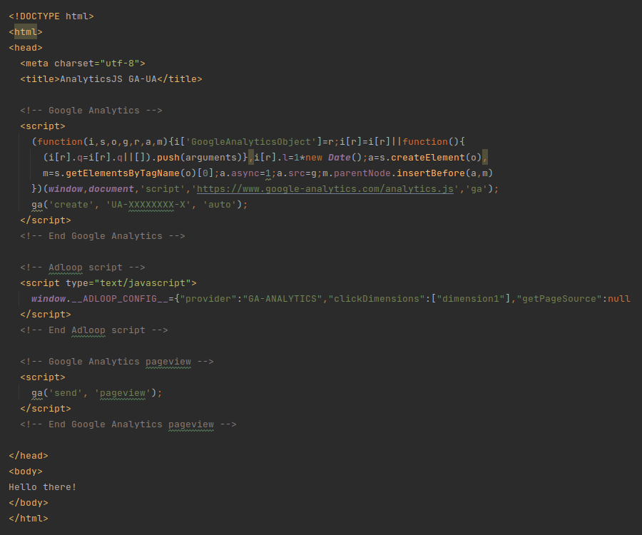
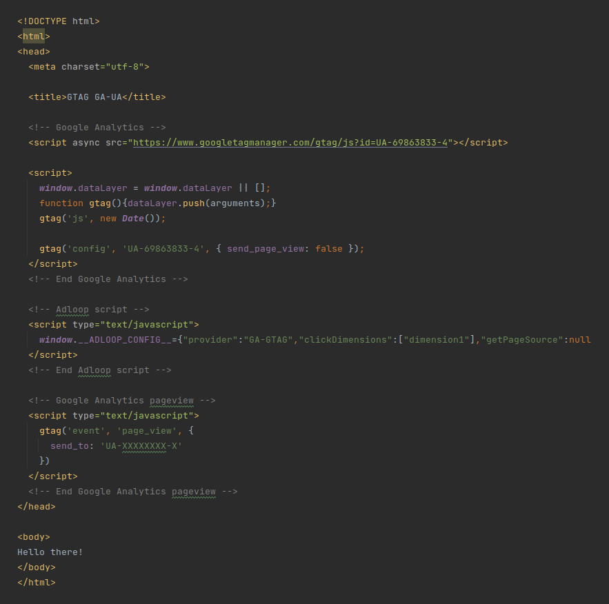

# Script installation without GTM

Get the script from the attribution source setup.

You have to place it after initializing the GA script but before sending the pageview:

Example:

analytics.jsgtag.js

