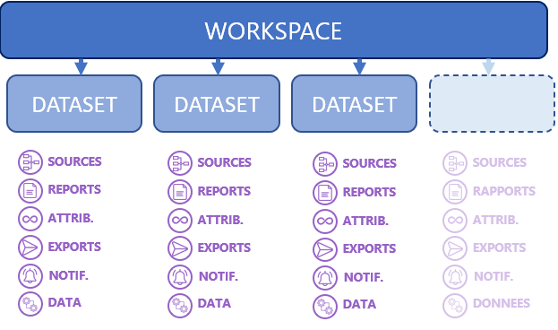
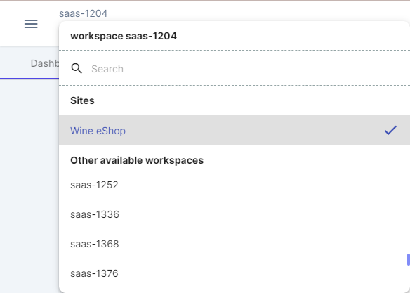

## Data structure in Adloop

The data structure of Adloop is organized in two layers:

1.  **The Workspace** , accessible at an address such as [ **https://company.adloop.co** ](https://societe.adloop.co)

1.  **Sites** (previously **Datasets** ) which contain data, reports, exports, notifications etc.

To put it simply, the  **Workspace**  is the company and the **Sites**  represent the brands or markets.

An example with an emblematic brand:  **Apple**  (Tim, if you are reading this...): the Workspace will be [ **https://apple.adloop.co** ](https://apple.adloop.co) and the Sites: Apple France, Apple US, Apple UK - in which we will look at campaign info on these markets.

## Workspace

## 

The Adloop Account of a company

An Adloop Workspace allows a Company to manage all of its markets or an Agency to manage some of its customers.

It is created by an  **Administrator**  through the available creation processes (Free Trial, Token sent by Adloop, ...).

An Adloop Workspace login address is always following this model : [ **https://company.adloop.co** ](https://societe.adloop.co) . The subdomain (host) ' **company** ' is freely chosen by the user who creates it.

### Billing Unit

 **The Workspace**  is the Adloop billing unit: the duration of access rights and subscriptions are active for all  **Sites** .

When the  **Subscription**  is terminated: an error message will be displayed when attempting to connect to the Workspace and access will no longer be possible unless renewed.

If the monthly Ad Spend amount of the  **Subscription**  is reached during the month, access will still be possible but the  **Data Source**  APIs will pause until the beginning of the next month. An informational email will be sent to the  **Administrator**  and an error message will be displayed for all  **Users** .

The Ad Spend amount of the **workspace**  can be found in the **Sites**  section ( **_the total amount is only accessible to the Administrators_** ).

### Sites

The  **Site**  contains the data from the  **Data Sources**  you have connected and all of Adloop's functionality on that data (Reports, Exports, Notifications etc.).

The list of Sites you have access to in the current Workspace is shown in the top left menu as shown below:

 **Sites**  are completely 'watertight' between each other: a  **User**  or an  **Administrator**  can have access to one  **Site**  but not another within the same  **Workspace** .

