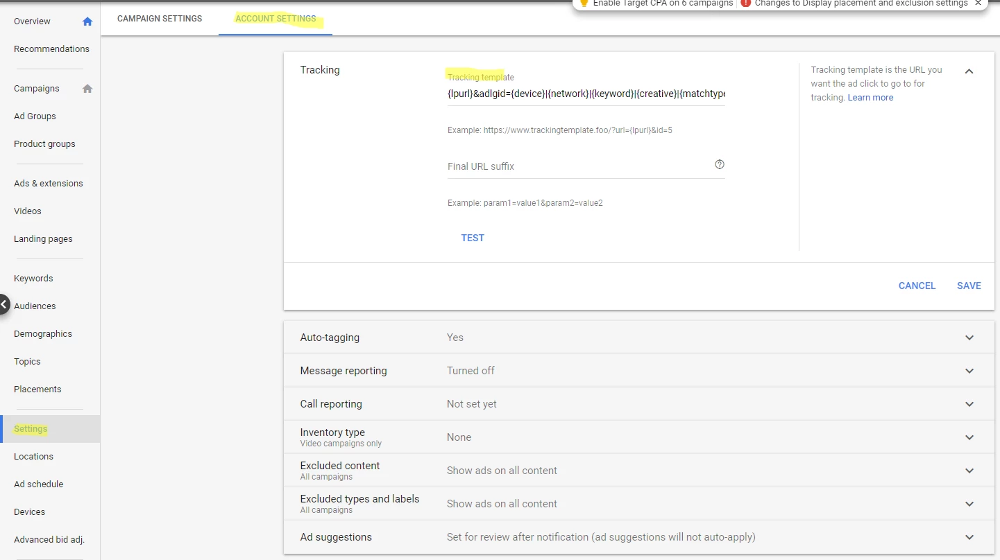
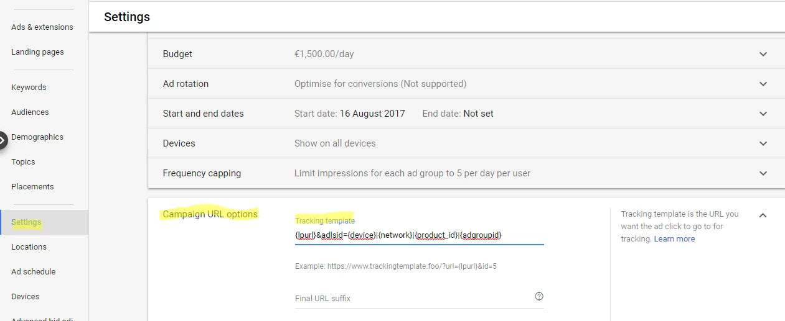
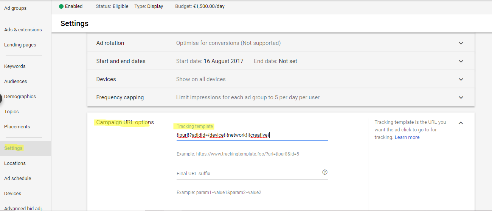
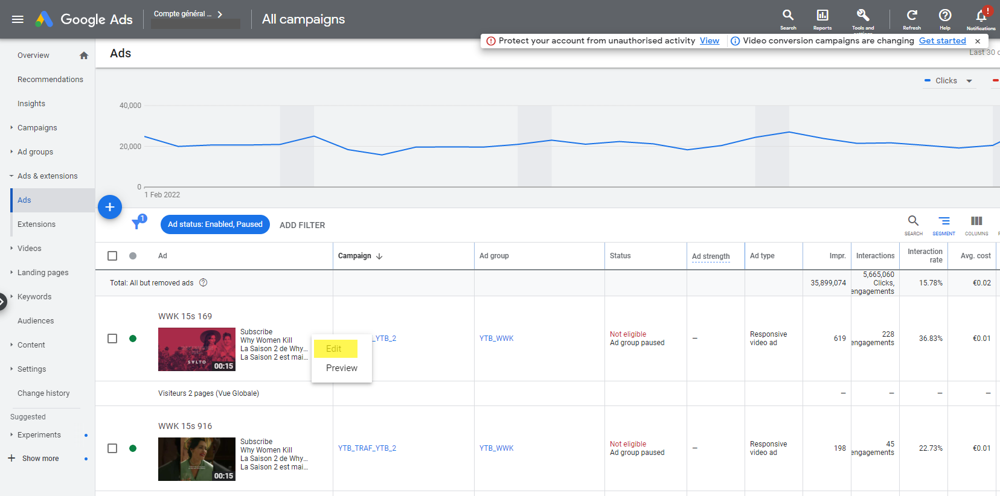
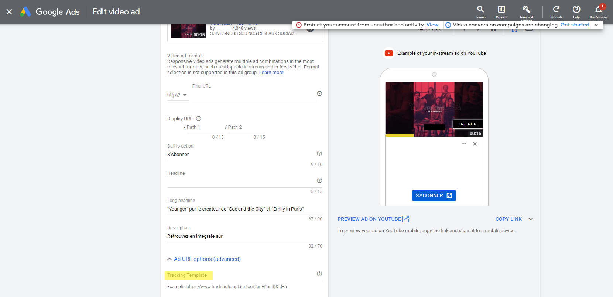

# a. Google Ads : URL templates for Search / Shopping / Display / Youtube campaigns

> Search is the (default ) mode of URL templates for **Google** Ads. If you run **Shopping** or **Display,** **Youtube,** **Performance Max** or **Discovery** campaigns, don’t forget to follow the dedicated instructions below .

## :Google\_Ads: a. Google Search Campaigns

|                                            |                                                                                                                                                                                                                                                                                                                              |
| ------------------------------------------ | ---------------------------------------------------------------------------------------------------------------------------------------------------------------------------------------------------------------------------------------------------------------------------------------------------------------------------- |
| **Level in which I put the URL templates** | Account level                                                                                                                                                                                                                                                                                                                |
| **Where is it located ?**                  | Go to _"All campaigns" > "Settings" > "Account Settings" > Tracking_                                                                                                                                                                                                                                                         |
| **What parameters should I use ?**         | loopcd → (for all analytics platforms)                                                                                                                                                                                                                                                                                       |
| **URL template**                           | **If Adloop is the only tracking template** , just copy-paste the following `{lpurl}?loopcd=SEg\|{device}\|{network}\|{keyword}\|{creative}\|{matchtype}`. **If Adloop isn't the only tracking template,** add the following to the existing template `&loopcd=SEg\|{device}\|{network}\|{keyword}\|{creative}\|{matchtype}` |

## :shopping: b. Google Shopping Campaigns

|                                            |                                                                                                                                                                                                                                                                                                            |
| ------------------------------------------ | ---------------------------------------------------------------------------------------------------------------------------------------------------------------------------------------------------------------------------------------------------------------------------------------------------------- |
| **Level in which I put the URL templates** | Campaign level                                                                                                                                                                                                                                                                                             |
| **Where is it located ?**                  | Go to your _Shopping campaign  > Settings > Campaign URL options_                                                                                                                                                                                                                                          |
| **What parameters should I use ?**         | loopcd → (for all analytics platforms)                                                                                                                                                                                                                                                                     |
| **URL template**                           | **If Adloop is the only tracking template** , just copy-paste the following `{lpurl}?loopcd=COg\|{device}\|{network}\|{product_id}\|{adgroupid}`. **If Adloop isn't the only tracking template,** add the following to the existing template `&loopcd=COg\|{device}\|{network}\|{product_id}\|{adgroupid}` |

## :Google\_Ads: c. Google Display Campaigns

|                                            |                                                                                                                                                                                                                                                                              |
| ------------------------------------------ | ---------------------------------------------------------------------------------------------------------------------------------------------------------------------------------------------------------------------------------------------------------------------------- |
| **Level in which I put the URL templates** | Campaign level                                                                                                                                                                                                                                                               |
| **Where is it located ?**                  | Go to your _Display campaign  > Settings > Campaign URL options_                                                                                                                                                                                                             |
| **What parameters should I use ?**         | loopcd → (for all analytics platforms)                                                                                                                                                                                                                                       |
| **URL template**                           | **If Adloop is the only tracking template** , just copy-paste the following `{lpurl}?loopcd=DIs\|{device}\|{network}\|{creative}`. **If Adloop isn't the only tracking template**, add the following to the existing template `&loopcd=DIs\|{device}\|{network}\|{creative}` |

## :youtube: d. Youtube Campaigns

|                                            |                                                                                                                                                                                                                                                                             |
| ------------------------------------------ | --------------------------------------------------------------------------------------------------------------------------------------------------------------------------------------------------------------------------------------------------------------------------- |
| **Level in which I put the URL templates** | Video Ad level                                                                                                                                                                                                                                                              |
| **Where is it located ?**                  | Go to your _Video campaign > Ad & Extensions_ Select the video ad, click on _Edit_ and go to _Ad URL options (advanced)_ There you can find the _Tracking Template field_ Copy paste the URL template & Save changes                                                        |
| **What parameters should I use ?**         | loopcd → (for all analytics platforms)                                                                                                                                                                                                                                      |
| **URL template**                           | **If Adloop is the only tracking template**, just copy-paste the following `{lpurl}?loopcd=DIy\|{device}\|{network}\|{creative}`. **If Adloop isn't the only tracking template,** add the following to the existing template `&loopcd=DIy\|{device}\|{network}\|{creative}` |

 

## :Google\_Ads: e. Performance Max campaigns

|                                            |                                                                                                                                                                                                                                                                                                             |
| ------------------------------------------ | ----------------------------------------------------------------------------------------------------------------------------------------------------------------------------------------------------------------------------------------------------------------------------------------------------------- |
| **Level in which I put the URL templates** | Campaign level                                                                                                                                                                                                                                                                                              |
| **Where is it located ?**                  | Go to your _Performance Max campaign  > Settings > Campaign URL options_                                                                                                                                                                                                                                    |
| **What parameters should I use ?**         | loopcd → (for all analytics platforms)                                                                                                                                                                                                                                                                      |
| **URL template**                           | **If Adloop is the only tracking template** , just copy-paste the following `{lpurl}?loopcd=COp\|{device}\|{network}\|{campaignid}\|{product_id}` **If Adloop isn't the only tracking template,** add the following to the existing template `&loopcd=COp\|{device}\|{network}\|{campaignid}\|{product_id}` |

## f. :Google\_Ads: Discovery / Demand Gen campaigns

|                                            |                                                                                                                                                                                                                                                     |
| ------------------------------------------ | --------------------------------------------------------------------------------------------------------------------------------------------------------------------------------------------------------------------------------------------------- |
| **Level in which I put the URL templates** | Campaign level                                                                                                                                                                                                                                      |
| **Where is it located ?**                  | Go to your _Discovery campaign  > Settings > Campaign URL options_                                                                                                                                                                                  |
| **What parameters should I use ?**         | loopcd → (for all analytics platforms)                                                                                                                                                                                                              |
| **URL template**                           | **If Adloop is the only tracking template**,just copy-paste the following `{lpurl}?loopcd=DIc\|{device}\|{creative}` **If Adloop isn't the only tracking template,** add the following to the existing template `&loopcd=DIc\|{device}\|{creative}` |
