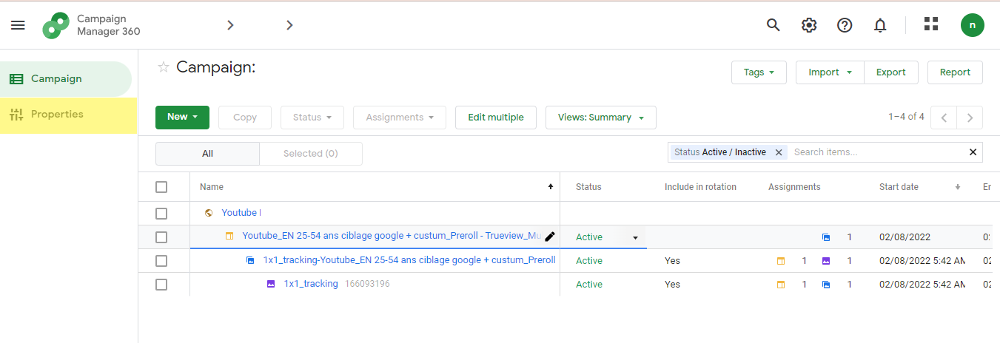
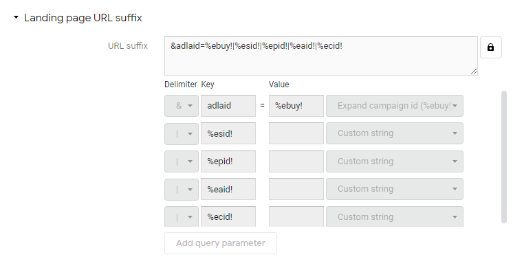

# a . Google Campaign Manager : URL templates for Display Campaigns

> **IMPORTANT ADVICE** 
Campaign Manager is sometimes used to agregate paid trafic & attribute conversions. In that case, some campaigns are  _double-tracked._ 
Campaigns shouldn’t be double-tracked as this affects data collection & measurement. If this is the case, contact the Adloop support, but generally campaigns should only be tracked in GCM.
Costs therefore should be integrated within GCM in order for Adloop to get them automatically. 

## Prerequisites
Before using the reporting & trafficking API, you must 

* have access to a Campaign Manager account ; more about this [here](https://marketingplatform.google.com/about/enterprise/)

* this account must be set for API access. It is often the case, but if you are not sure, contact the Campaign Manager support.

* you must have a profile to access this account. Ask your campaign manager admin to create a profile for you

* Check the permissions of Campaign Manager UI users. Those permissions control who, among the users, has API access. 

## URL Templates instructions

|||
|-|-|
|**Level in which I put the URL templates**| Campaign level (all existing active Campaigns + new Campaigns upon creation) |
|**Where is it located ?**| <ul><li>Go to the  _Campaign_  you want to track</li><li>Go to _Properties_ , </li><li>then go to the  _destination  URL suffix_  </li></ul>|
| **What parameters should I use ?**| loopcd |
| **URL template**| **If there is no suffix already, copy-paste the following** `&loopcd=DId\|%ebuy!\|%esid!\|%epid!\|%eaid!\|%ecid!` **If there is already a suffix, you have to add the same tracking template at the end of the existing suffix** `&loopcd=DId\|%ebuy!\|%esid!\|%epid!\|%eaid!\|%ecid!` |

*****

[[category.storage-team]] 
[[category.confluence]] 
