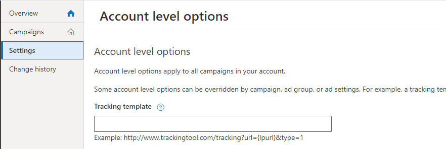
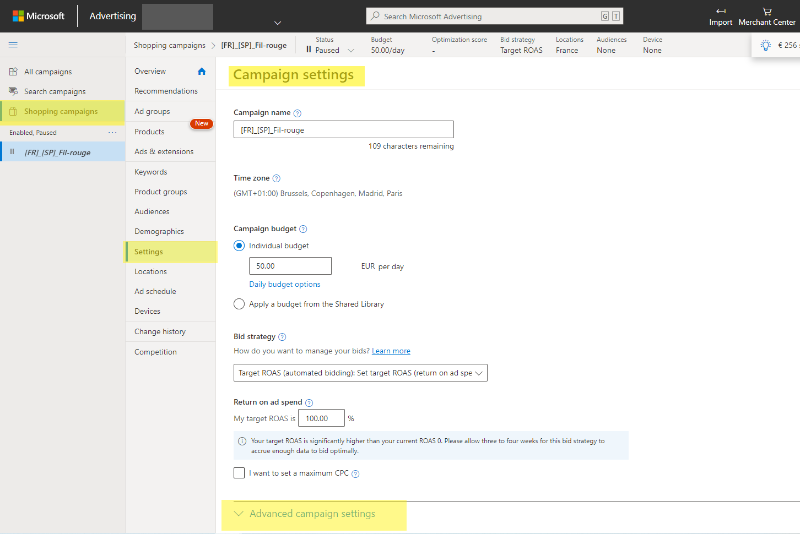
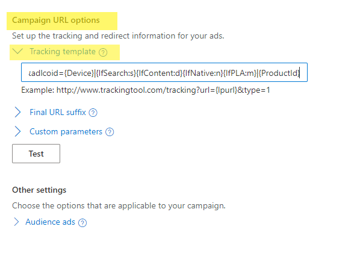

# b. Bing Ads : URL templates for Search & Shopping Campaigns

> Bing Search Campaigns use the default account level URL template
For DSA or Shopping Campaigns refer to the specific parameters

## a.  Bing Search campaigns 

|||
|-|-|
|**Level in which I put the URL templates**| Account level |
|**Where is it located ?**| On the left menu : click on  _Setting_ > _Account level options_ > _Tracking template_  |
|**What parameters should I use ?**| _loopcd_ (for all analytics platforms including Adobe, Google or Piano Analytics)using the  _utm_content_  parameter in substitution is possible (only for Google Analytics) |
|**URL template**|  **If Adloop is the only tracking template** , just copy-paste the following `{lpurl}?loopcd=SEb\|{Device}\|{IfSearch:s}{IfContent:d}{IfNative:n}{IfPLA:m}|{keyword:no_kw}\|{AdId}\|{MatchType}`. Just add the following string at the end of the destination URL `&loopcd=SEb\|{Device}\|{IfSearch:s}{IfContent:d}{IfNative:n}{IfPLA:m}\|{keyword:no_kw}\|{AdId}\|{MatchType}`. If you opt for the  _utm_content_ , use this value : `&utm_content=SEb\|{Device}\|{IfSearch:s}{IfContent:d}{IfNative:n}{IfPLA:m}\|{keyword:no_kw}\|{AdId}\|{MatchType}` |
|**Shoud I use both adlcoid & utm_content ?**| No, just chose one parameter and keep it consistent for all Bing Campaigns for now and the future  | 

## b.  DSA campaigns 

|||
|-|-|
|**Level in which I put the URL templates**| Campaign level |
|**Where is it located ?**| For each campaign: Campaign settings > Advanced setting > campaign URL options |
|**What parameters should I use ?**| _loopcd_ (for all analytics platforms including Adobe, Google or Piano Analytics)using the  _utm_content_  parameter in substitution is possible (only for Google Analytics) |
|**URL template**| **If Adloop is the only tracking template** , just copy-paste the following `{lpurl}?loopcd=SEb\|{Device}\|{IfSearch:s}{IfContent:d}{IfNative:n}{IfPLA:m}\|\|{AdId}\|{MatchType}`. Just add the following string at the end of the destination URL `&loopcd=SEb\|{Device}\|{IfSearch:s}{IfContent:d}{IfNative:n}{IfPLA:m}\|\|{AdId}\|{MatchType}`. If you opt for the  _utm_content_ , use this value : `&utm_content=SEb\|{Device}\|{IfSearch:s}{IfContent:d}{IfNative:n}{IfPLA:m}\|\|{AdId}\|{MatchType}` |
|**Shoud I use both adlcoid & utm_content ?**| No, just chose one parameter and keep it consistent for all Bing Campaigns for now and the future  |

## c.  Shopping campaigns

|||
|-|-|
|**Level in which I put the URL templates**| Campaign level | 
|**Where is it located ?**| For each campaign: Campaign settings > Advanced setting > campaign URL options |
|**What parameters should I use ?**| _loopcd_ (for all analytics platforms including Adobe, Google or Piano Analytics)using the  _utm_content_  parameter in substitution is possible (only for Google Analytics) |
|**URL template**| **If Adloop is the only tracking template** , just copy-paste the following `{lpurl}?loopcd=COb\|{Device}\|{IfSearch:s}{IfContent:d}{IfNative:n}{IfPLA:m}\|{ProductId}`. Just add the following string at the end of the destination URL `&loopcd=COb\|{Device}\|{IfSearch:s}{IfContent:d}{IfNative:n}{IfPLA:m}\|{ProductId}`. If you opt for the _utm_content_ , use this value : `&utm_content=COb\|{Device}\|{IfSearch:s}{IfContent:d}{IfNative:n}{IfPLA:m}\|{ProductId}` |
|**Shoud I use both adlcoid & utm_content ?**| No, just chose one parameter and keep it consistent for all Bing Campaigns for now and the future  |

